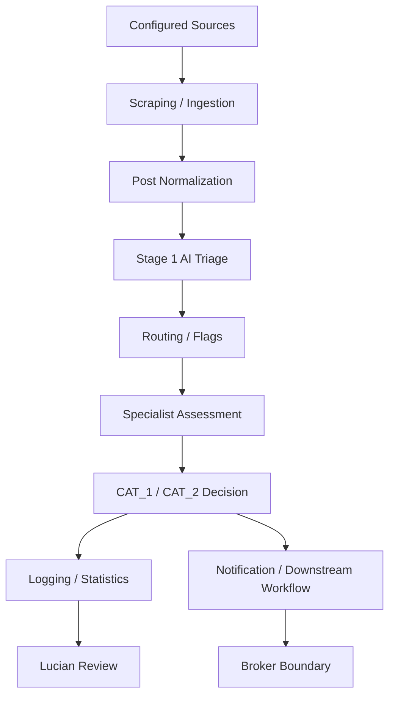
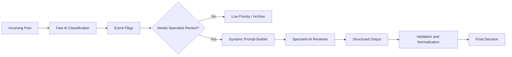
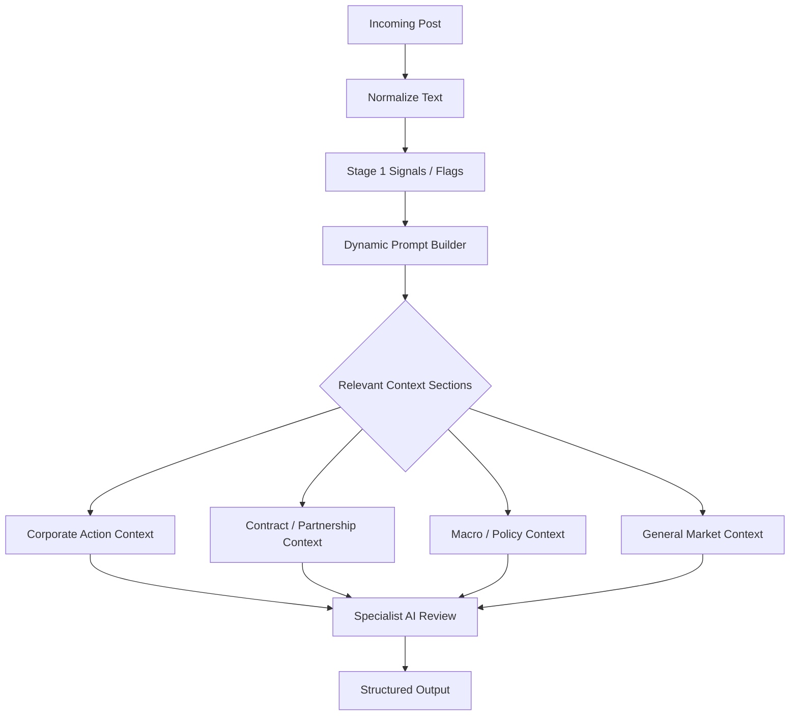
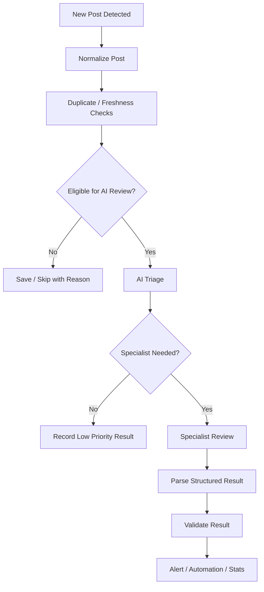
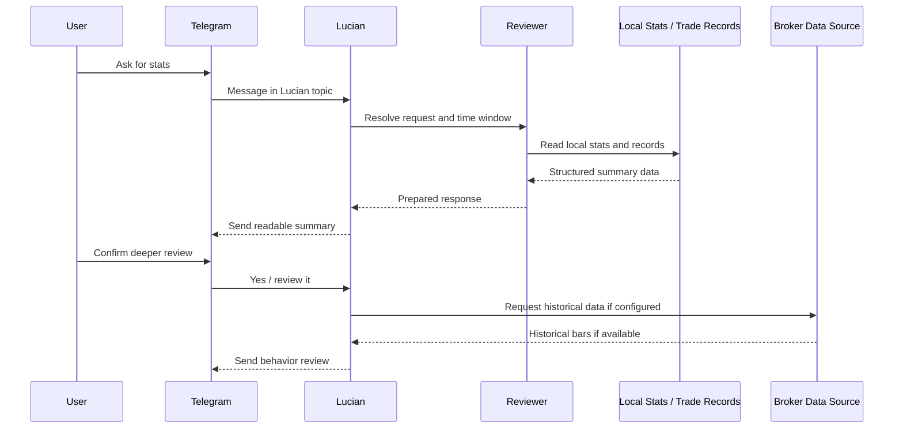

# Xander

## Overview

Xander is an AI-assisted financial news classification and automation system.

It processes posts from configured market-related sources, normalizes incoming information, classifies posts into actionable and non-actionable categories, and supports downstream logging, notification, review, and broker-related workflows.

This repository is intended as a public-safe engineering reference for the Xander system. Sensitive prompts, private trading rules, credentials, production configuration, broker account details, and real trading records are intentionally excluded or generalized.

## Current Scope

This repository describes the main Xander runtime structure:

- `launch_xander.py` coordinates local runtime scheduling, health checks, command routing, and Lucian weekly review.
- `SocialMarket/` contains source ingestion, post normalization, staged AI assessment, prompt assembly, and source statistics recording.
- `IBKR/` contains broker-integration code and related historical-data helpers. Public documentation treats this as a broker boundary and does not expose private account or execution details.
- `Lucian/` contains the review assistant modules: `launch_lucian.py`, `lucian_reviewer.py`, and `lucian_balance.py`.
- `SimilarityCheck/` contains support logic for repeated-post and similarity workflows.
- `Functions/` is a local runtime data and gateway folder. Public repos should include only sanitized examples or fixtures from this area.
- `.env.example` provides placeholder configuration names for local setup.

The public version is not a turnkey production deployment. It omits private credentials, private runtime data, account-specific broker settings, and sensitive prompt or execution logic.

## Problem

Market-related information is difficult to process manually at speed.

A single source can produce many posts in a short period of time. Some posts may be genuinely important, while others may be routine updates, summaries, market color, or noise. The value of the system is not only in detecting new information, but in deciding whether the information deserves further review.

Xander explores a workflow where AI helps with classification, routing, and summarization, while deterministic code handles structure, validation, logging, and guardrails.

The design goal is not to let AI make unchecked decisions. Instead, AI is used as one layer in a broader system that emphasizes speed, repeatability, reviewability, and clear separation of responsibilities.

## What Xander Does

At a high level, Xander:

- Monitors selected financial news, social, and feed-style sources.
- Converts incoming posts into a consistent internal format.
- Filters obvious duplicates and low-signal items.
- Uses AI to classify whether a post may be meaningful.
- Extracts broad event signals and routing hints.
- Sends selected posts to specialist AI review based on event type.
- Converts AI responses into structured decisions.
- Sends concise Telegram alerts for human review.
- Produces structured outputs for downstream workflows.
- Records aggregate source and assessment statistics.
- Supports post-session review through Lucian, a companion review assistant.

The public repository focuses on architecture and workflow. Private execution logic and sensitive operating details are not included.

## How AI Is Used

AI is used in stages rather than as a single all-purpose decision step.

The first stage is designed to be fast. It checks whether a post appears relevant, extracts broad event flags, and helps decide whether a deeper review is justified. This keeps the system from spending heavier analysis on every incoming item.

If the post appears meaningful, it is routed to a more focused specialist review path. The specialist stage evaluates the event in context and returns a structured output that the rest of the system can validate and process.

Xander uses AI for:

- First-pass relevance checks.
- Event classification.
- Broad signal and flag extraction.
- Dynamic prompt section selection.
- Specialist review by event type.
- Structured output generation.
- Human-readable summaries.
- Review assistance through Lucian.

AI outputs are not treated as raw free-form text. They are parsed, normalized, and checked by deterministic code before being used by later stages.

Private prompt contents, exact routing rules, model-selection details, thresholds, and execution logic are intentionally not documented here.

## Models Used

Xander uses a task-based AI design instead of relying on one model for everything.

Different model layers serve different roles:

- Fast classification models handle first-pass assessment. Their role is to quickly decide whether an incoming post is likely irrelevant, potentially meaningful, or worth deeper review.
- Specialist review models are used when a post appears to involve a specific event type. They receive focused context and return structured outputs that downstream logic can process.
- A local LLM can be used by Lucian to interpret natural-language review requests, such as asking for trade performance this week, post assessment stats from yesterday, all stats last week, or review of a previous trade.

The exact model choices are configurable and may change over time. The important architectural point is the separation of roles: fast triage, focused specialist review, and local review assistance.

Current model/runtime roles include:

| Model / Runtime | Role | Why It Is Used |
|---|---|---|
| GPT-4o-mini | Fast first-pass classification and event signal extraction | Low-latency, cost-aware triage |
| GPT-4.1-mini | Focused specialist review for selected event types | Structured assessment with more event-specific context |
| GPT-4o | Deeper specialist review where broader reasoning is useful | Broader review for selected complex cases |
| Section-selection model (GPT-4o) | Dynamic prompt section selection | Chooses which context blocks are relevant before specialist review |
| Local Ollama model (llama3.1:8b) | Lucian request understanding and summary wording | Local natural-language interpretation for review workflows |

This layered approach keeps the system faster and more cost-aware while still allowing deeper analysis when the incoming post justifies it.

## High-Level Architecture

The system starts with source monitoring and normalization, then moves into AI assessment and structured routing. Alerts and downstream workflows are generated only after the post has passed through the relevant checks.

## AI Assessment Pipeline

The AI pipeline separates broad triage from deeper assessment.

This helps keep the workflow cost-aware and easier to reason about. Fast checks handle high-volume filtering. Specialist review is reserved for posts that appear more relevant.

The structured output step is important. It allows the rest of the system to treat AI results as data rather than only as prose.

## Dynamic Prompt Builder

Xander uses a dynamic prompt builder to keep AI requests focused.

Instead of sending one large instruction set for every incoming post, Xander selects the relevant context sections based on what the post appears to need. A short headline about an acquisition, for example, does not need the same context as a macro policy update or a capital structure announcement.

At a high level, the system first identifies broad signals from the incoming post. It then assembles only the prompt sections needed for that situation before sending the post to specialist review.

This design helps with:

- Lower token usage.
- Faster responses.
- Cleaner model focus.
- Less prompt bloat.
- Easier maintenance of review logic.
- Better separation between general triage and specialist analysis.

The dynamic prompt builder does not expose or publish private prompt contents in this repository. The public documentation describes the architecture, not the proprietary instruction text.

The prompt builder connects model usage with context management. Faster models can help with early triage and section selection, while specialist review receives a smaller, more relevant prompt for the event being assessed.

## Key Components

### `launch_xander.py`

Coordinates the local runtime, scheduled tasks, health checks, Telegram command routing, service supervision, gateway file creation, and Lucian weekend review.

### `SocialMarket/`

Contains the main source ingestion and AI assessment workflow. It handles post normalization, duplicate/freshness checks, Stage 1 triage, specialist routing, dynamic prompt assembly, alert formatting, and source statistics recording.

### `SocialMarket/PROMPTS/`

Contains prompt families, prompt sections, skeletons, and installer/update helpers. Public documentation describes the prompt architecture without publishing private prompt logic verbatim.

### `IBKR/`

Contains broker-integration code and historical-data helpers. It is treated as a separate execution boundary from the AI classification layer. Account-specific settings, credentials, and private execution parameters should remain outside the public repo.

### `Lucian/`

Contains the review assistant modules:

- `lucian_reviewer.py` reads local stats and trade-history data to produce summaries.
- `lucian_balance.py` records weekend balance snapshots for review reporting when configured.
- `launch_lucian.py` provides a local one-shot test wrapper.

Lucian is intentionally separate from the live scraping assessment path.

### `SimilarityCheck/`

Contains support logic for repeated-post and similarity workflows.

### `Functions/`

Stores local runtime flags, gateway files, source statistics, trade-history exports, and review artifacts. Public versions should include only sanitized examples or test fixtures from this folder.

### `.env.example`

Provides placeholder environment variables for local configuration. Real `.env` files should not be committed.

## IBKR Execution And Risk Boundary

Xander includes an IBKR integration layer for broker-side automation, post-entry order management, balance review, and optional historical-data review.

The AI assessment layer does not directly place trades. AI outputs are converted into structured decisions, then passed through separate validation and execution-handling logic before reaching the broker integration layer.

This separation keeps the AI workflow, alerting layer, and broker-side automation easier to reason about independently.

The IBKR layer is responsible for order placement, position monitoring, take-profit / stop-loss placement, and exit handling. It also derives a market-cap-aware risk profile for approved trade candidates. During trade preparation, Xander attempts to determine the target ticker's market cap and records it in the order file as a marker such as `MARKETCAP AT <value>`.

That market-cap value is used to select a risk profile that can influence allocation, take-profit, stop-loss, fixed trailing, and dynamic trailing behavior. In general, larger-cap stocks can use tighter controls, mid-cap names use more moderate settings, and lower-market-cap names can use smaller allocation with wider risk bands to account for higher volatility. Earnings-related trades can use a separate profile. Exact values are configurable and private deployment-specific.

Example configurable risk profile:

| Trade profile | Allocation | Take profit | Stop loss |
|---|---:|---:|---:|
| Failed market-cap lookup / fallback | 35% | 4% | 2% |
| Earnings with large-cap profile | 35% | 4% | 2% |
| Non-earnings mega-cap profile | 50% | 2% | 1% |
| Non-earnings mid-cap profile | 35% | 6% | 3% |
| Non-earnings lower-market-cap profile | 15% | 10% | 5% |

Recent updates also allow the selected risk profile to be persisted at entry with enough metadata for downstream order management and post-trade review. Persisting the profile helps later steps use the same assumptions selected at entry and improves auditability without relying on mutable order text.

Lucian can also use IBKR historical data for optional deeper trade reviews. If IBKR is not connected or historical data is unavailable, Lucian reports that the review cannot proceed rather than falling back to public market-data sources.

## Stats and Logging

The system records aggregate assessment activity and operational logs. These records support later review, source comparison, and reliability checks.

Source statistics are stored in local JSON files under the runtime data folder. Recent versions support daily source-stat buckets so Lucian can summarize a reporting window without relying only on lifetime aggregate totals.

## Processing Lifecycle

This lifecycle keeps the live workflow explicit. Each step has a focused role, and the system can log why a post moved forward or why it stopped.

## Lucian: Review Assistant

Lucian is a companion assistant for reviewing Xander's activity.

It can answer questions such as:

- How did the latest trading window perform?
- How many posts were assessed this week?
- Which sources produced more higher-priority activity?
- What happened during the previous session?
- Should specific trades be reviewed more deeply?

Lucian is designed for on-demand review. It can summarize trade performance, source assessment statistics, weekly activity, selected post-session behavior, and weekend balance progress when configured.

For deeper trade review, Lucian can use broker-side historical data when configured and available. If that data is unavailable, Lucian should explain the limitation rather than falling back to unrelated public price sources.

Lucian does not need access to private strategy rules to summarize activity. It works from structured logs, statistics, and review data produced by Xander.

## Data, Logs, and Review Layer

Xander keeps a review layer separate from live processing.

This layer is used for:

- Source assessment counts.
- Aggregate classification statistics.
- Operational logs.
- Trade or action history summaries.
- Weekly and ad hoc review windows.
- Lucian responses.

The purpose of this layer is to make system behavior easier to inspect after the fact. It also helps separate live decisions from later analysis.

## Public / Private Boundary

The public repository may include:

- Sanitized architecture documentation.
- Placeholder `.env.example` values.
- Non-sensitive helper logic.
- Mock or synthetic sample data.
- Public-safe prompt skeletons or reduced examples.
- Tests for parsing, aggregation, and validation behavior.

The private runtime should keep:

- Real API keys and service credentials.
- Telegram tokens, usernames, chat IDs, and thread IDs.
- Broker account details and broker configuration.
- Machine-specific absolute paths.
- Production scheduling and deployment details.
- Private prompt logic if it contains proprietary classification rules.
- Exact trade execution parameters and risk controls.
- Real trade files, logs, account balances, and runtime artifacts.

## Tech Stack

Xander is primarily built with:

- Python.
- OpenAI-compatible AI workflows.
- Local LLM tooling where useful.
- Task-based model selection.
- Dynamic prompt assembly.
- Telegram bot integration.
- Broker integration layer.
- Local file-based automation.
- Structured JSON outputs.
- Logging and scheduled background tasks.
- Mermaid diagrams for architecture documentation.

## Disclaimer

This project is not financial advice.

It is an automation and AI-assisted analysis system. Any live deployment requires proper risk controls, credentials management, broker configuration, monitoring, and independent review.
